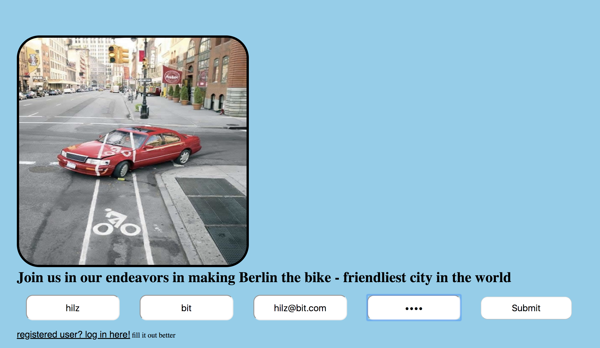
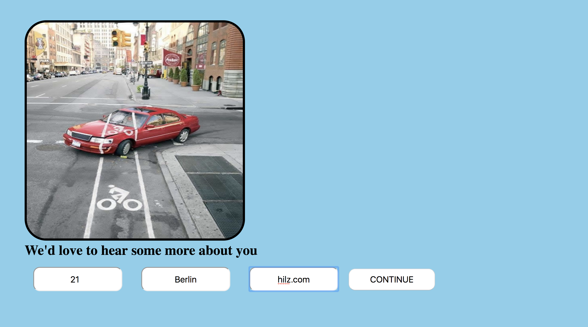
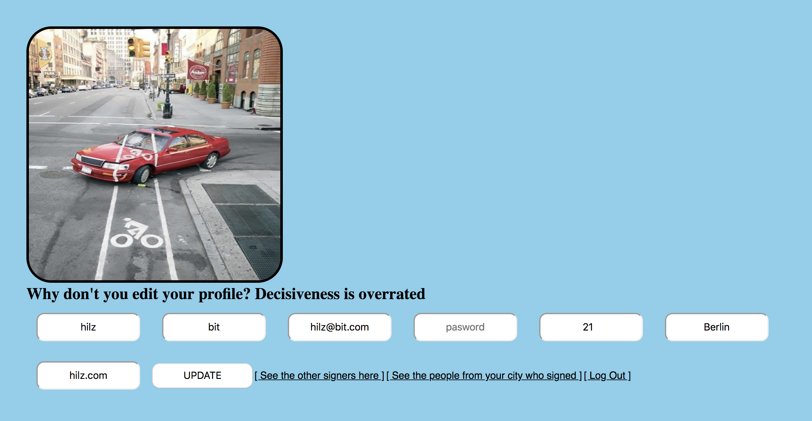
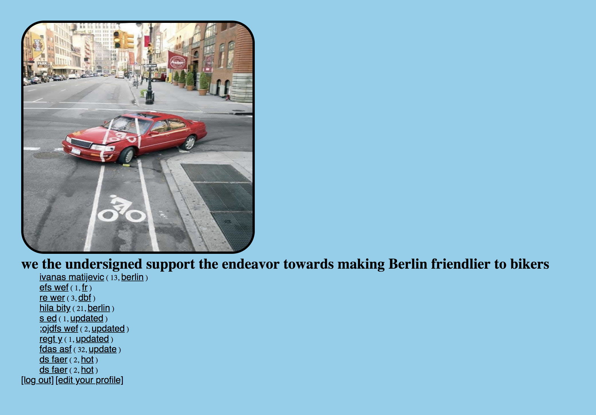
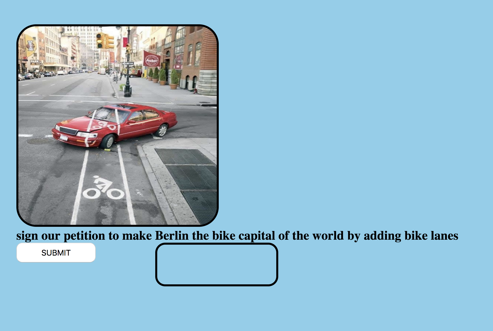
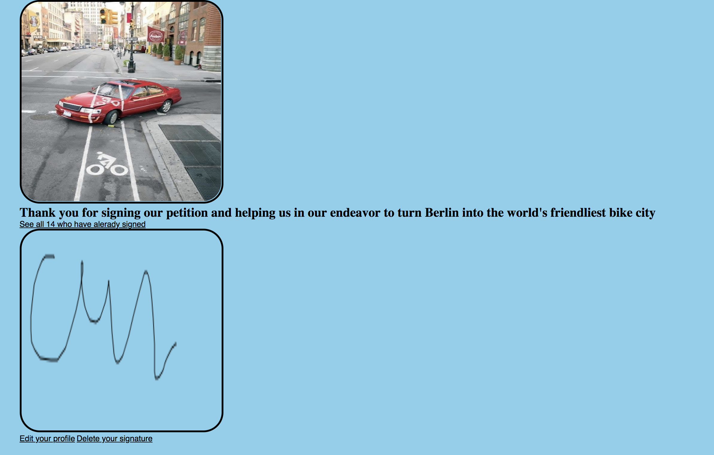

# petition
sign my petition to make Berlin a bicycle-friendlier city

The idea behind this project is to create an online petition that visitors can sign to make their voice heard on an issue of their choosing.

# Features:

1. Login and registration.

2. A canvas element where the users can physically sign save their signature.

3. PostgresSQL as database.

### Images:

