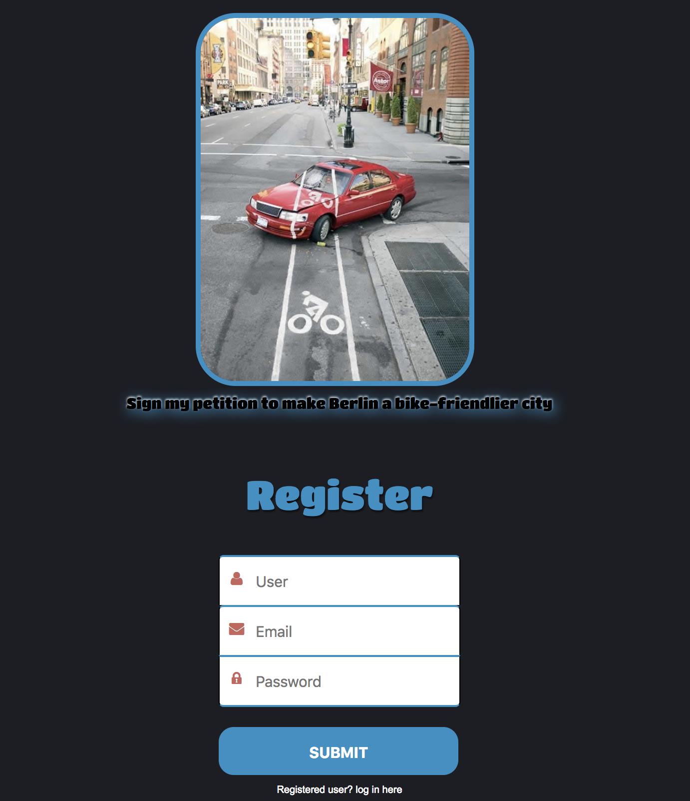

# Petition

Cycling is a way of life.
sign my petition to make Berlin a bicycle-friendlier city

The idea behind this project is to create an online petition that visitors can sign to make their voice heard on an issue of their choosing.

# Features:

* Login and registration.

* A canvas element where the users can physically sign and save their signature.

* PostgreSQL as database.

[The app is also available on Heroku in a slightly different version](https://hilaspetition.herokuapp.com/)

